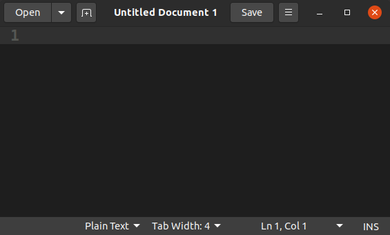

# Gedit


[**Gedit**](https://wiki.gnome.org/Apps/Gedit) is the default text editor on Linux distributions that use the [GNOME](http://www.gnome.org) desktop environment.

## Features

Gedit has very limited support for Swift:

✅ Syntax highlighting \
❌ Formatting \
❌ Completion \
❌ Quick help \
❌ Diagnostics \
❌ Fix-its \
❌ Refactoring \
❌ Run executables \
❌ Debugging \
❌ Testing

Nevertheless, it’s useful because it’s included with the GNOME desktop, so it doesn’t require any additional installation steps.

## Usage

Open the **Text Editor** application or start Gedit from the command line:

```
gedit &
```

> **Note**: The ampersand (`&`) after this command is optional. It launches Gedit in the background so that you can continue using the terminal. 

When Gedit launches, it creates an empty file:



Save this file with the **.swift** extension to make it a Swift file. 

> **Note**: You may have to reopen the file or set its language from Plain Text to Swift in the status bar to enable syntax highlighting.

To open existing files, press the **Open** button in the header bar. On the command line, you specify the files you want to open as arguments for the `gedit` command:

```
gedit main.swift square.swift &
```


When using Gedit, you’ll have to keep a terminal window open as well. Gedit can only edit files, so you’ll have to compile and run your code from the command line.

---

Last updated: 24 Oct. 2020 \
Author: [Steven Van Impe](https://github.com/svanimpe)
