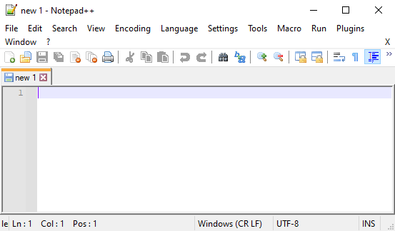
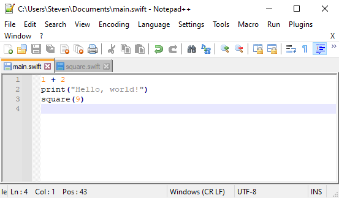
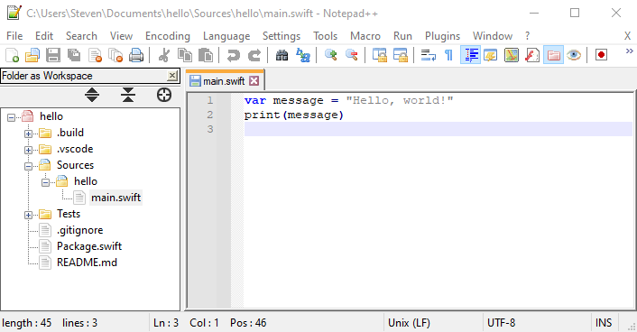

# Notepad++

[**Notepad++**](https://notepad-plus-plus.org) is popular replacement for the default **Notepad** text editor that comes with Windows.

## Features

Notepad++ has very limited support for Swift:

✅ Syntax highlighting \
❌ Formatting \
❌ Completion \
❌ Quick help \
❌ Diagnostics \
❌ Fix-its \
❌ Refactoring \
❌ Run executables \
❌ Debugging \
❌ Testing

## Installation

To install Notepad++, download the latest 64-bit installer from [notepad-plus-plus.org](https://notepad-plus-plus.org/downloads/).

## Usage

When you launch Notepad++, it creates an empty file:

Save this file with the **.swift** extension to make it a Swift file. 

To open existing files, select **File ▸ Open...** from the menu bar:

To open a Swift package, select **File ▸ Open Folder as Workspace...** from the menu bar:

When using Notepad++, you’ll have to keep a terminal window open as well. Notepad++ can only edit files, so you’ll have to compile and run your code from the command line.

---

Last updated: 5 Nov. 2020 \
Author: [Steven Van Impe](https://github.com/svanimpe)
