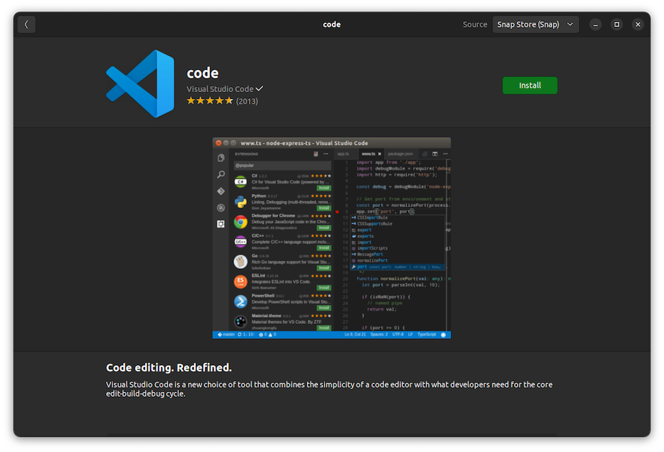
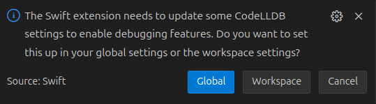
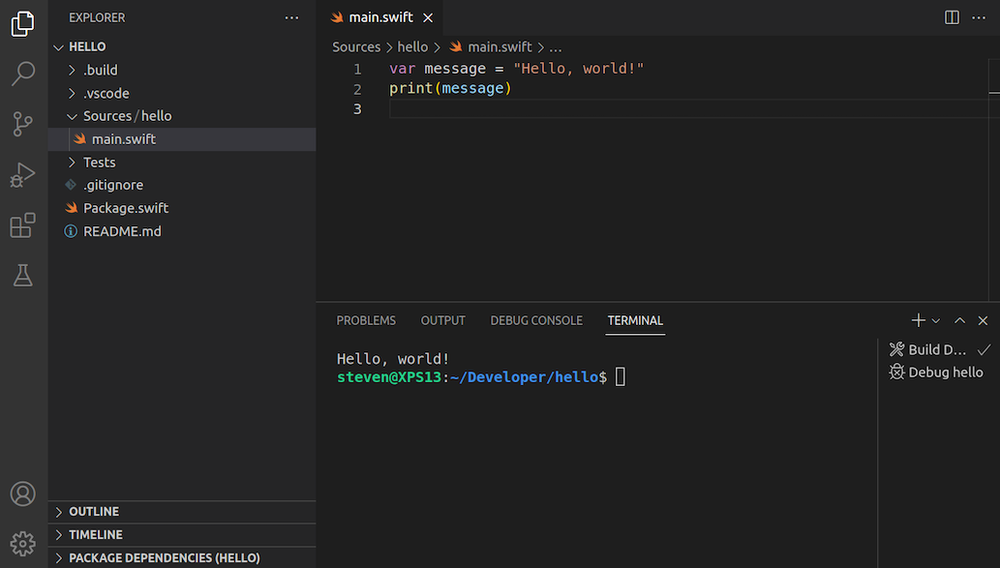
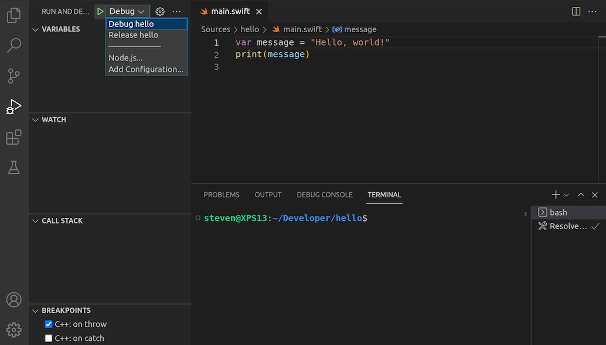
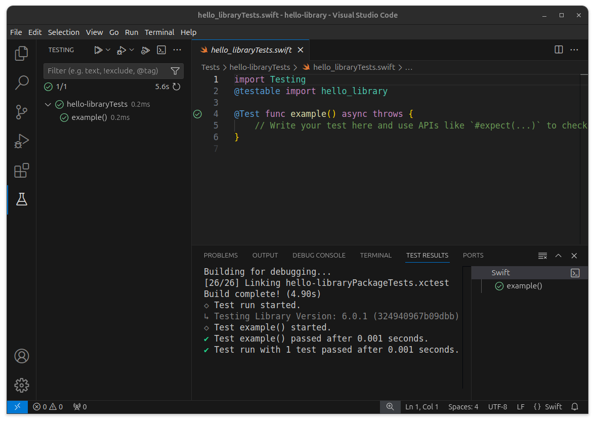

# Visual Studio Code


[**Visual Studio Code**](https://code.visualstudio.com) is a free and open source editor developed by Microsoft. It’s a cross-platform editor that supports many languages, including Swift.

## Features

Out of the box, Visual Studio Code supports syntax highlighting and code formatting for Swift. However, you can greatly extend its functionality by installing the [**Swift extension**](https://marketplace.visualstudio.com/items?itemName=sswg.swift-lang). The result is a very capable editor:

✅ Syntax highlighting \
✅ Formatting \
✅ Completion \
✅ Quick help \
✅ Diagnostics \
✅ Fix-its \
❌ Refactoring \
✅ Run executables \
✅ Debugging \
✅ Testing

## Installation

On Ubuntu, install Visual Studio Code via the **Ubuntu Software** application:



On Fedora, install Visual Studio Code from the [**Snap Store**](https://snapcraft.io). First, run the following commands in **Terminal** to install Snap:

```
sudo dnf install snapd
sudo ln -s /var/lib/snapd/snap /snap
```

> **Note**: These commands require administrator privileges, so they’ll ask for your password.

Next, log out or restart your system. After logging back in, install Visual Studio Code with the following command:

```
sudo snap install --classic code
```

After installation, you can launch Visual Studio Code from the **Activities** screen:


You can also launch it from the command line, using the **`code`** command:

```
code
```

### Swift extension

To install the Swift extension, select **View ▸ Extensions** from the menu bar, search “swift”, and install the extension published by the Swift Server Work Group:


The Swift extension includes the [**CodeLLDB extension**](https://marketplace.visualstudio.com/items?itemName=vadimcn.vscode-lldb), on which it depends to run and debug programs using **LLDB**.

After installation, the extension will prompt you to configure a Swift-specific version of LLDB:



Select **Global** unless you intend to configure a custom version of LLDB.

## Usage

To edit files with Visual Studio Code, select **File ▸ Open File...** from the menu bar or specify the files you want to open as arguments for the `code` command:

```
code hello.swift
```


If you specify a file that doesn’t exist, Visual Studio Code will create it for you. Alternatively, you can create files by selecting **File ▸ New File** from the menu bar.

If the file you’re editing contains top-level executable code, you can run it by opening the **Command Palette** (**View ▸ Command Palette...**) and selecting **Swift: Run Swift Script**:


You’ll see the output of your program appear in the integrated terminal. 

To edit a Swift package, select **File ▸ Open Folder...** from the menu bar and open the directory that contains the **Package.swift** file. On the command line, you specify this directory as an argument for the `code` command:

```
code hello
```


To run your code, select **Run ▸ Run Without Debugging** from the menu bar or press **Ctrl+F5**:



You’ll see the output of your program appear in the integrated terminal. If the terminal is hidden, select **View ▸ Terminal** from the menu bar to show it.

If your package contains multiple executable targets, select **View ▸ Run** from the menu bar to open the **Run and Debug** view. There, you can select a target to run:



### Debugging

To debug a program, first set a breakpoint by clicking next to the line of code where you want the debugger to pause execution:


Next, select **Run ▸ Start Debugging** from the menu bar or press **F5** to start the debugger:


Use the integrated terminal, the debug console, and the floating toolbar to interact with the program.

When you’re done debugging, use the **Stop** button on the floating toolbar or press **Shift+F5** to stop the debugger.

## Testing

To run unit tests, select **View ▸ Testing** from the menu bar to open the **Test Explorer**. There, you can either run all tests, or run a specific target, class, or test:



If the Test Explorer shows a test discovery error, select **Terminal ▸ Run Build Task...** from the menu bar and run the **swift: Build All** task to build the test targets.

Test results will appear in the integrated terminal, in the Test Explorer, and in the editor.

---

Last updated: 23 Sept. 2022 \
Author: [Steven Van Impe](https://github.com/svanimpe)
