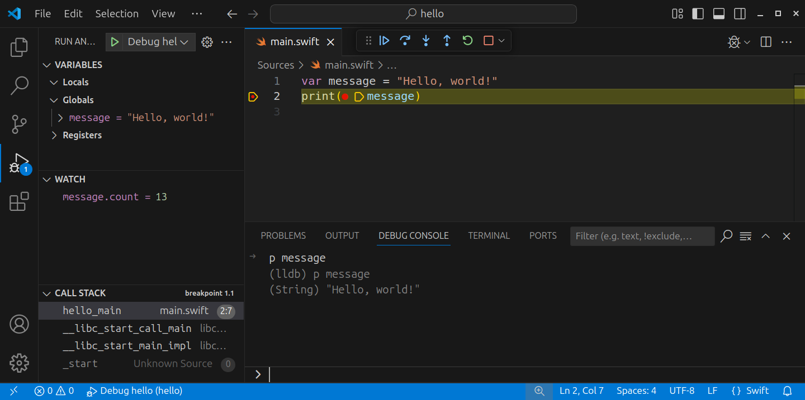

# Visual Studio Code


[**Visual Studio Code**](https://code.visualstudio.com) is a free and open source editor developed by Microsoft. It’s a cross-platform editor that supports many languages, including Swift.

## Features

Out of the box, Visual Studio Code supports syntax highlighting and code formatting for Swift. However, you can greatly extend its functionality by installing the [**SourceKit-LSP**](https://github.com/apple/sourcekit-lsp) and [**CodeLLDB**](https://marketplace.visualstudio.com/items?itemName=vadimcn.vscode-lldb) extensions. The result is a very capable editor:

✅ Syntax highlighting \
✅ Formatting \
✅ Completion (SourceKit-LSP) \
✅ Quick help (SourceKit-LSP) \
✅ Diagnostics (SourceKit-LSP) \
✅ Fix-its (SourceKit-LSP) \
❌ Refactoring \
✅ Run executables (CodeLLDB) \
✅ Debugging (CodeLLDB) \
❌ Testing

## Installation

On Ubuntu, download and install Visual Studio Code via the **Ubuntu Software** application:


On Fedora and CentOS/RHEL, run the following commands in **Terminal** to install the Visual Studio Code repository:

```
sudo rpm --import https://packages.microsoft.com/keys/microsoft.asc
sudo sh -c 'echo -e "[code]\nname=Visual Studio Code\nbaseurl=https://packages.microsoft.com/yumrepos/vscode\nenabled=1\ngpgcheck=1\ngpgkey=https://packages.microsoft.com/keys/microsoft.asc" > /etc/yum.repos.d/vscode.repo'
```

> **Note**: These commands require administrator privileges, so they’ll ask for your password.

Then update the package cache and install Visual Studio Code:

```
sudo dnf check-update
sudo dnf install code
```

After installation, you can launch Visual Studio Code from the **Activities** screen:


You can also launch it from the command line, using the **`code`** command:

```
code
```

### SourceKit-LSP

The [**SourceKit-LSP**](https://github.com/apple/sourcekit-lsp) extension is still in development, so you’ll have to install it from source code.

First, install the software you need to build this source code. The command for this depends on your distribution:

```
# On Ubuntu, run:
sudo apt install npm

# On Fedora and CentOS/RHEL, run:
sudo dnf install npm
```

Next, download the source code:

```
cd ~/Downloads
git clone https://github.com/apple/sourcekit-lsp
```

Now build the extension:

```
cd sourcekit-lsp/Editors/vscode
npm run createDevPackage
```

This creates an extension named **sourcekit-lsp-vscode-dev.vsix** in the **out** directory. Install this extension as follows:

```
code --install-extension out/sourcekit-lsp-vscode-dev.vsix
```

Finally, remove the downloaded source files:

```
cd ~/Downloads
rm -rf sourcekit-lsp
```

### CodeLLDB

The [**CodeLLDB**](https://marketplace.visualstudio.com/items?itemName=vadimcn.vscode-lldb) extension lets you run and debug programs using the **LLDB** debugger. Swift also uses LLDB, so you can use this extension to run and debug Swift programs.

To install CodeLLDB, select **View ▸ Extensions** from the menu bar, search the extensions marketplace for CodeLLDB, and install it:


Next, you’ll configure this extension to use the version of LLDB that’s included with Swift. Select **File ▸ Preferences ▸ Settings** from the menu bar and search for the **Lldb: Library** setting:


Enter the correct value for your distribution:

* On Ubuntu, enter **/opt/swift/usr/lib/liblldb.so**. This assumes that you’ve installed Swift in **/opt/swift** according to the installation instructions for [Swift on Ubuntu](../../platforms/ubuntu/README.md).
* On Fedora and CentOS/RHEL, enter **/usr/libexec/swift/lib/liblldb.so**.

## Usage

To edit files with Visual Studio Code, select **File ▸ Open File...** from the menu bar or specify the files you want to open as arguments for the `code` command:

```
code main.swift
```


If you specify a file that doesn’t exist, Visual Studio Code will create it for you. Alternatively, you can create files by selecting **File ▸ New File** from the menu bar.

To edit a Swift package, select **File ▸ Open Folder...** and open the directory that contains the **Package.swift** file. On the command line, you specify this directory as an argument for the `code` command:

```
code hello
```


> **Note**: The SourceKit-LSP extension will not work properly until you build your package. It also requires you to reload the package when you add or remove source files.

### Integrated terminal

Visual Studio Code includes an integrated terminal that you can use to run your code. To open this terminal, select **View ▸ Terminal** from the menu bar:


### Debugging

The CodeLLDB extension lets you run and debug your code directly from Visual Studio Code, without using the integrated terminal. However, before you can do that, you have to add a few configuration files to your Swift package.

Select **View ▸ Run** from the menu bar to open the **Run and Debug** view:


Select **create a launch.json file**, then select **LLDB**:


This adds a **launch.json** file to the **.vscode** directory in your package. Change the contents of this file to the following:

```json
{
    "version": "0.2.0",
    "configurations": [
        {
            "type": "lldb",
            "request": "launch",
            "name": "Debug",
            "program": "${workspaceFolder}/.build/debug/<program>",
            "args": [],
            "cwd": "${workspaceFolder}",
            "preLaunchTask": "swift build",
        }
    ]
}
```

Replace `<program>` with the name of your executable target. You can find this name in **Package.swift**. Most likely, it’s also the name of your package.

The **launch.json** file mentions a `swift build` task. You’ll create this task now.

Select **Terminal ▸ Run Build Task...** from the menu bar, then select **Configure Build Task...**:


Next, select **Create tasks.json file from template**:


Then select **Others**:


This adds a **tasks.json** file to the **.vscode** directory. Change the contents of this file to the following:

```json
{
    "version": "2.0.0",
    "tasks": [
        {
            "label": "swift build",
            "type": "shell",
            "command": "swift build",
            "group": {
                "kind": "build",
                "isDefault": true
            }
        }
    ]
}
```

You can now use the CodeLLDB extension to run and debug your program.

> **Note**: You’ll have to repeat the previous steps when you create a new package. Fortunately, you can just copy the **.vscode** directory to your new package and change the name of your program in **launch.json**.

To run your program with CodeLLDB, select **Run ▸ Run Without Debugging** from the menu bar or press **Ctrl+F5**.

To debug the program, first set a breakpoint by clicking next to the line of code where you want the debugger to pause execution:


Select **Run ▸ Start Debugging** from the menu bar or press **F5** to start the debugger:



Use the integrated terminal, the debug console, and the floating toolbar to interact with your program.

When you’re done debugging, use the **Stop** button on the floating toolbar or press **Shift+F5** to stop the debugger.

---

Last updated: 24 Oct. 2020 \
Author: [Steven Van Impe](https://github.com/svanimpe)
