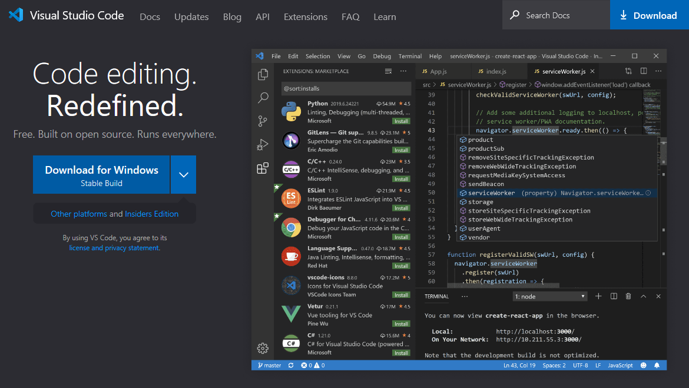
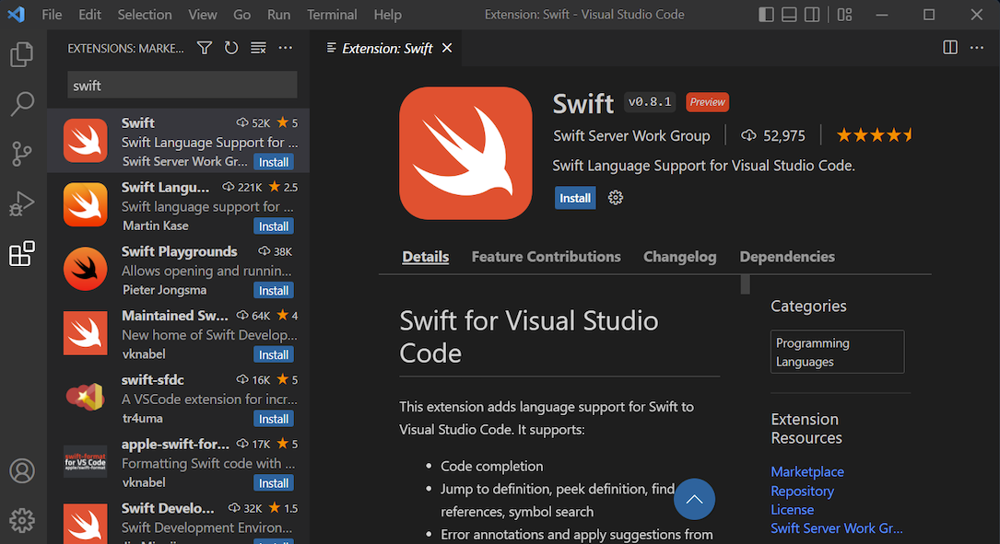
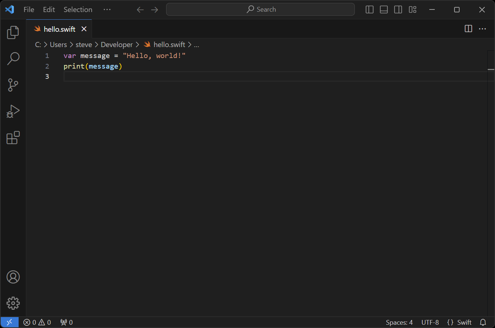
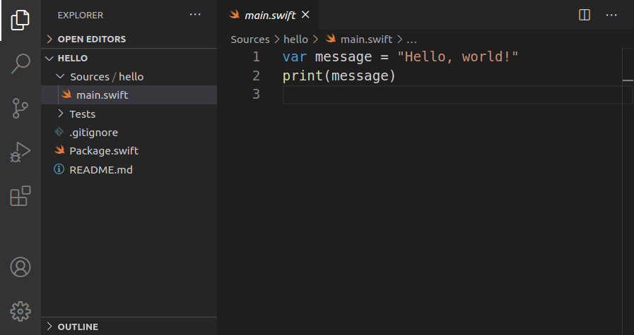
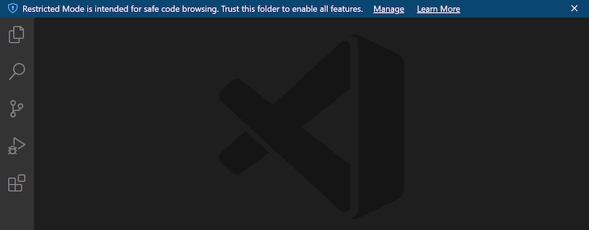
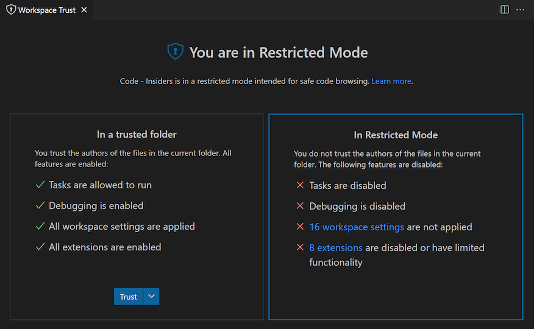
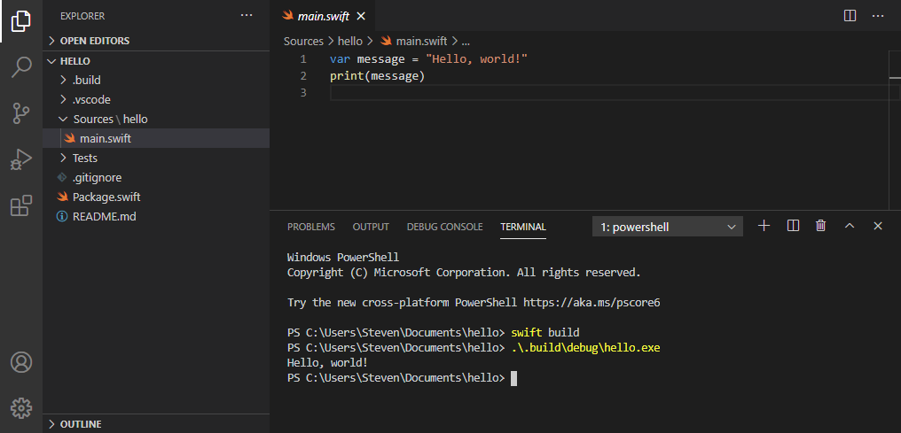
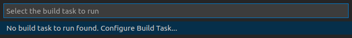
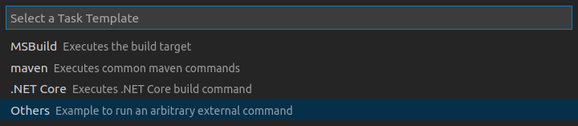

# Visual Studio Code (Windows)


[**Visual Studio Code**](https://code.visualstudio.com) is a free and open source editor developed by Microsoft. It’s a cross-platform editor that supports many languages, including Swift.

## Features

Out of the box, Visual Studio Code supports syntax highlighting and code formatting for Swift. However, you can greatly extend its functionality by installing the [**SourceKit-LSP**](https://github.com/apple/sourcekit-lsp) extension. The result is a very capable editor:

✅ Syntax highlighting \
✅ Formatting \
✅ Completion (SourceKit-LSP) \
✅ Quick help (SourceKit-LSP) \
✅ Diagnostics (SourceKit-LSP) \
✅ Fix-its (SourceKit-LSP) \
❌ Refactoring \
✅ Run executables \
❌ Debugging \
❌ Testing

## Installation

Download and install Visual Studio Code from [code.visualstudio.com](https://code.visualstudio.com):



After installation, you can launch Visual Studio Code from the **Start** menu. You can also launch it from the command line, using the **`code`** command:

```
code
```

### SourceKit-LSP

The **SourceKit-LSP** extension is still in development. For easy installation, you can download the latest version from our repository:

⬇️ [Download the SourceKit-LSP extension](../../downloads/sourcekit-lsp-development.vsix)

To install this extension, select **View ▸ Extensions** from the menu bar, click the triple dots, then select **Install from VSIX...**:



Browse to the **sourcekit-lsp-development.vsix** file you downloaded earlier, and install it.

## Usage

To edit files with Visual Studio Code, select **File ▸ Open File...** from the menu bar or specify the files you want to open as arguments for the `code` command:

```
code main.swift
```



If you specify a file that doesn’t exist, Visual Studio Code will create it for you. Alternatively, you can create files by selecting **File ▸ New File** from the menu bar.

To edit a Swift package, select **File ▸ Open Folder...** and open the directory that contains the **Package.swift** file. On the command line, you specify this directory as an argument for the `code` command:

```
code hello
```



Note that the SourceKit-LSP extension will not work properly until you build your package. It also requires you to reload the package when you add or remove source files.

### Workspace trust settings

Visual Studio Code may open your workspace in **restricted mode**, which will disable the SourceKit-LSP extension:



If you’re seeing this banner, click **Manage**, then **Trust** to enable all features and extensions:



### Integrated terminal

Visual Studio Code includes an integrated terminal that you can use to build and run your code. To open this terminal, select **View ▸ Terminal** from the menu bar:



### Creating a build task

You can create a build task to make your package easier to run. Select **Terminal ▸ Run Build Task...** from the menu bar, then select **Configure Build Task...**:



Next, select **Create tasks.json file from template**:


Then select **Others**:



This adds a **tasks.json** file to the **.vscode** directory in your package. Change the contents of this file to the following:

```json
{
    "version": "2.0.0",
    "tasks": [
        {
            "label": "swift build",
            "type": "shell",
            "command": "swift build; if ($?) { .build\\debug\\<program>.exe }",
            "group": {
                "kind": "build",
                "isDefault": true
            }
        }
    ]
}
```

Replace `<program>` with the name of your executable target. You can find this name in **Package.swift**. Most likely, it’s also the name of your package.

You can now select **Terminal ▸ Run Build Task...** from the menu bar or press **Ctrl+Shift+B** to run this task. The task will first run `swift build` to compile your package and, if that succeeds, run your executable. You’ll find its output in the integrated terminal.

---

Last updated: 7 Oct. 2021 \
Author: [Steven Van Impe](https://github.com/svanimpe)
