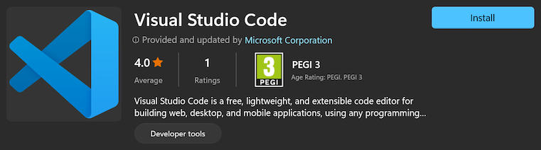
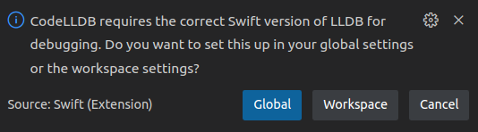
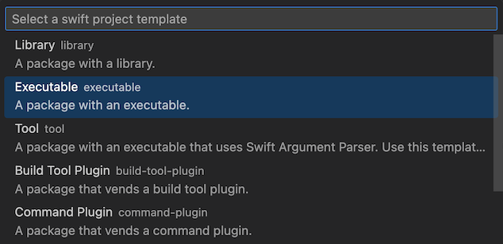
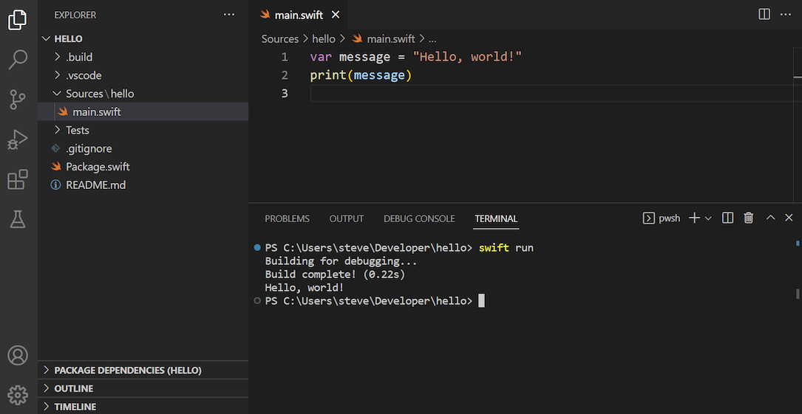
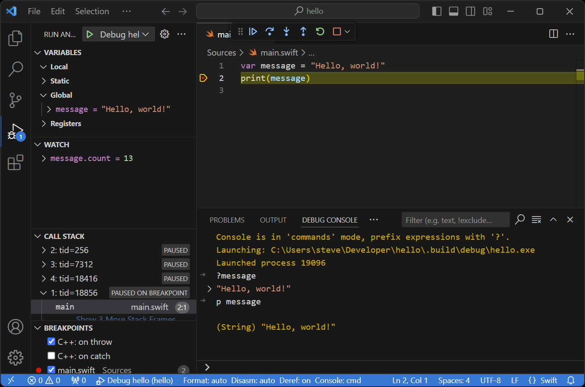
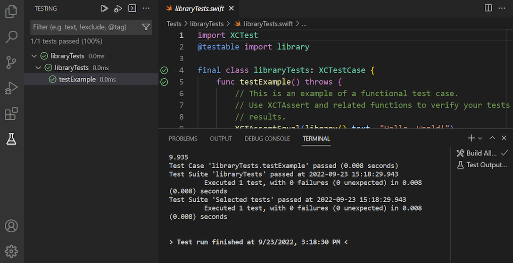

# Visual Studio Code (Windows)


[**Visual Studio Code**](https://code.visualstudio.com) is a free and open source editor developed by Microsoft. It’s a cross-platform editor that supports many languages, including Swift.

## Features

Out of the box, Visual Studio Code supports syntax highlighting and code formatting for Swift. However, you can greatly extend its functionality by installing the [**Swift extension**](https://marketplace.visualstudio.com/items?itemName=sswg.swift-lang). The result is a very capable editor:

✅ Syntax highlighting \
✅ Formatting \
✅ Completion \
✅ Quick help \
✅ Diagnostics \
✅ Fix-its \
✅ Refactoring \
✅ Run executables \
✅ Debugging \
✅ Testing

## Installation

Download and install Visual Studio Code from [code.visualstudio.com](https://code.visualstudio.com) or from the Microsoft Store:



After installation, you can launch Visual Studio Code from the **Start** menu. You can also launch it from the command line, using the **`code`** command:

```
code
```

## Installing the Swift extension

To install the Swift extension, select **View ▸ Extensions** from the menu bar, search “swift”, and install the extension published by the Swift Server Work Group:


The Swift extension includes the [**CodeLLDB extension**](https://marketplace.visualstudio.com/items?itemName=vadimcn.vscode-lldb), on which it depends to run and debug programs using **LLDB**.

The first time it's activated, the extension will prompt you to configure a Swift-specific version of LLDB:



Select **Global** when you see this prompt.

## Editing files

To edit files with Visual Studio Code, select **File ▸ Open File...** from the menu bar, or specify the files you want to open as arguments for the `code` command:

```
code hello.swift
```


If you specify a file that doesn’t exist, Visual Studio Code will create it for you. Alternatively, you can create files by selecting **File ▸ New File** from the menu bar.

## Editing packages

To create a new Swift package with an executable program, open the **Explorer** (**View ▸ Explorer**) and select **Create Swift Project**:


Then select **Executable**:



To open an existing package, select **File ▸ Open Folder...** from the menu bar and open the directory that contains the **Package.swift** file.

On the command line, you specify this directory as an argument for the `code` command:

```
code hello
```


To run your code, select **Run ▸ Run Without Debugging** from the menu bar or press **Ctrl+F5**.

Unfortunately, Visual Studio Code will open an external terminal and you won’t see the output of your program. Therefore, you may want to run your program from the integrated terminal instead:



If the terminal is hidden, select **View ▸ Terminal** from the menu bar to show it.

## Debugging

To debug a program, first set a breakpoint by clicking next to the line of code where you want the debugger to pause execution:


Next, select **Run ▸ Start Debugging** from the menu bar or press **F5** to start the debugger:



Use the debug console and the floating toolbar to interact with the program.

When you’re done debugging, use the **Stop** button on the floating toolbar or press **Shift+F5** to stop the debugger.

## Testing

To run unit tests, select **View ▸ Testing** from the menu bar to open the **Test Explorer**. There, you can either run all tests, or run specific tests or suites:



Test results will appear in the Test Explorer, the Test Results pane, and in the editor.

---

Last updated: 4 Nov. 2024 \
Author: [Steven Van Impe](https://github.com/svanimpe)
