# Visual Studio Code

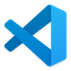

[**Visual Studio Code**](https://code.visualstudio.com) is a free and open source editor developed by Microsoft. It’s a cross-platform editor that supports many languages, including Swift.

## Features

Out of the box, Visual Studio Code supports syntax highlighting and code formatting for Swift. However, you can greatly extend its functionality by installing the [**Swift extension**](https://marketplace.visualstudio.com/items?itemName=swiftlang.swift-vscode). The result is a very capable editor:

✅ Syntax highlighting \
✅ Formatting \
✅ Completion \
✅ Quick help \
✅ Diagnostics \
✅ Fix-its \
✅ Refactoring \
✅ Run executables \
✅ Debugging \
✅ Testing

## Installation on Windows

Download and install Visual Studio Code from [code.visualstudio.com](https://code.visualstudio.com) or from the Microsoft Store:

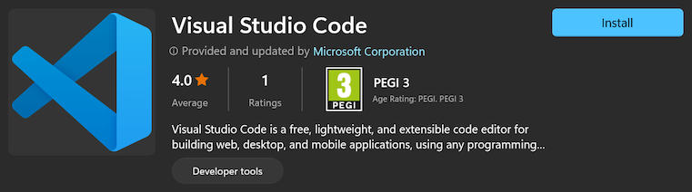

After installation, you can launch Visual Studio Code from the **Start** menu. You can also launch it from the command line, using the **`code`** command:

```
code
```

## Installation on Linux

On Linux, Visual Studio Code is distributed as a [**Snap**](https://snapcraft.io) package. 

On Fedora, first install Snap with the following commands, then log out or restart your system:

```
sudo dnf install -y snapd
sudo ln -s /var/lib/snapd/snap /snap
```

Ubuntu has built-in support for Snap, so it doesn't require these steps.

Run the following command to install Visual Studio Code: 

```
sudo snap install --classic code
```

After installation, you can launch Visual Studio Code by pressing the **Super** (or **Command** or **Windows**) key and searching for it. You can also launch it from the command line, using the **`code`** command:

```
code
```

## Installing the Swift extension

To install the Swift extension, select **View ▸ Extensions** from the menu bar, search “swift”, and install the extension published by [swift.org](https://www.swift.org):

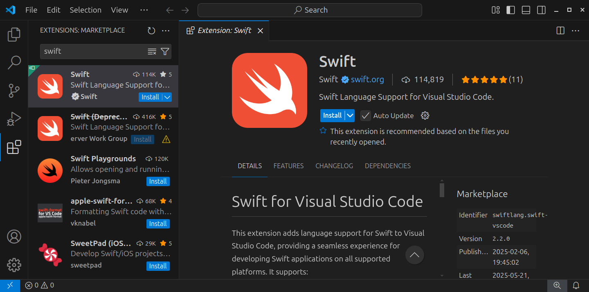

## Editing files

To edit files with Visual Studio Code, select **File ▸ Open File...** from the menu bar, or specify the files you want to open as arguments for the `code` command:

```
code hello.swift
```

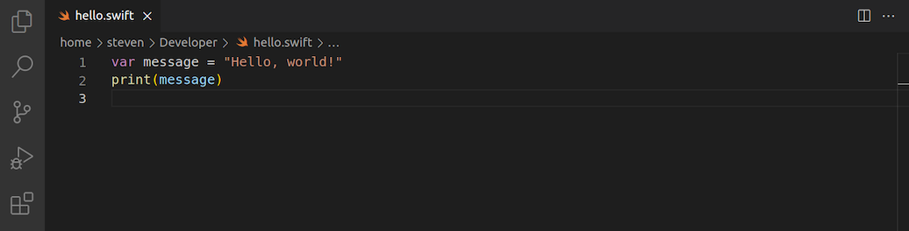

If you specify a file that doesn’t exist, Visual Studio Code will create it for you. Alternatively, you can create files by selecting **File ▸ New File...** from the menu bar.

If the file you’re editing contains top-level executable code, you can run it by opening the **Command Palette** (**View ▸ Command Palette...**) and selecting **Swift: Run Swift Script**:

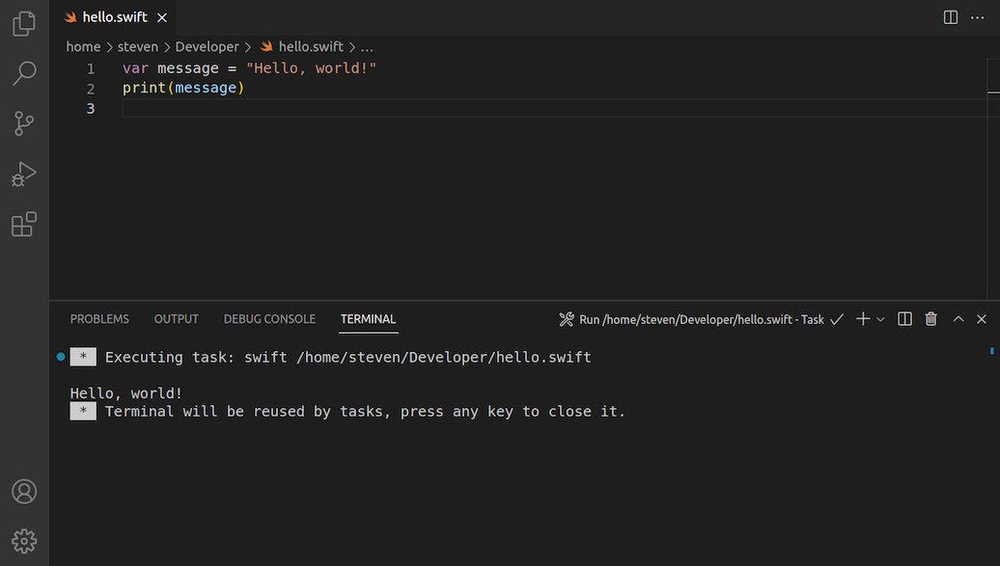

> **Note**: This feature is unsupported on Windows.

You’ll see the output of your program appear in the integrated terminal. If the terminal is hidden, select **View ▸ Terminal** from the menu bar to show it.

## Editing packages

To create a new Swift package with an executable program, open the **Explorer** (**View ▸ Explorer**) and select **Create Swift Project**:

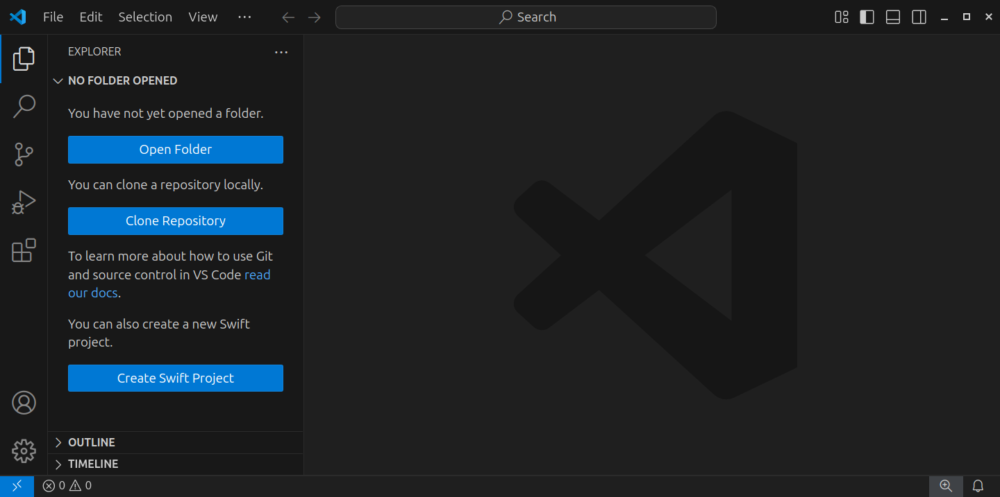

Then select **Executable**:

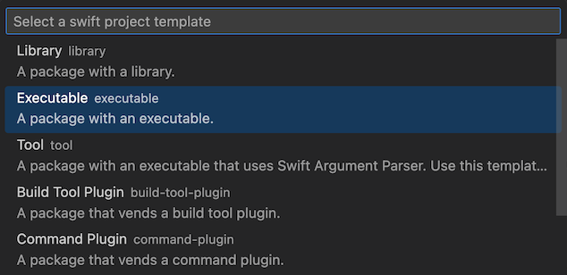

To open an existing package, select **File ▸ Open Folder...** from the menu bar and open the directory that contains the **Package.swift** file.

On the command line, you specify this directory as an argument for the `code` command:

```
code hello
```

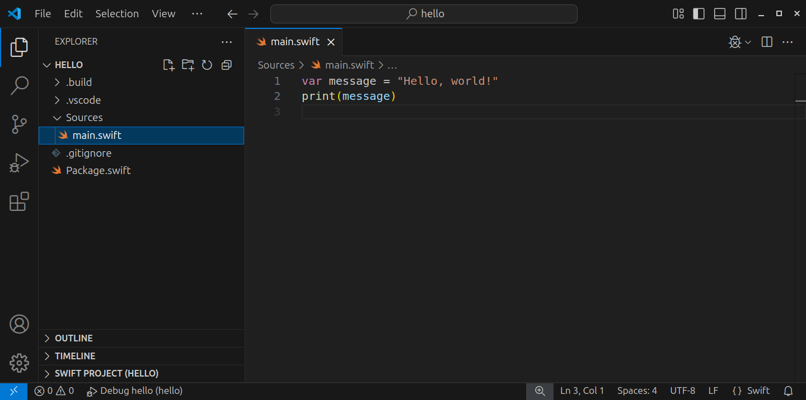

To run your code, select **Run ▸ Run Without Debugging** from the menu bar or press **Ctrl+F5**:

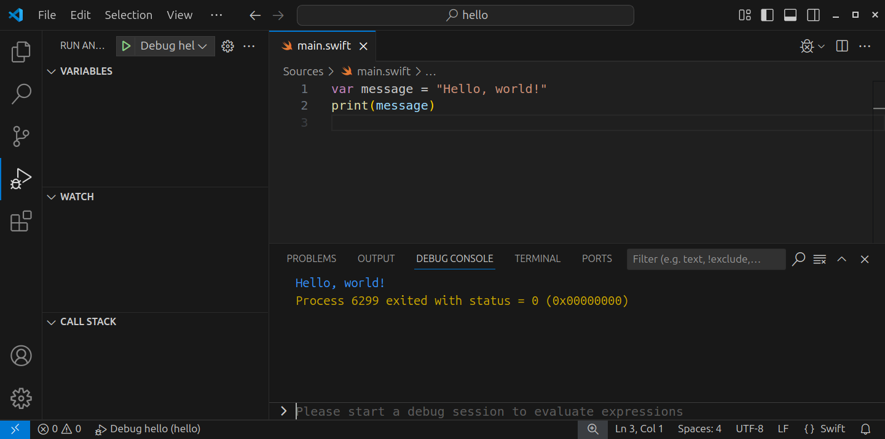

You’ll see the output of your program appear in the debug console. If the console is hidden, select **View ▸ Debug Console** from the menu bar to show it.

> **Note**: The debug console doesn't support interactive programs. If your program uses `readLine` to read input from the command line, then use `swift run` in the integrated terminal to start it.

## Debugging

To debug a program, first set a breakpoint by clicking next to the line of code where you want the debugger to pause execution:

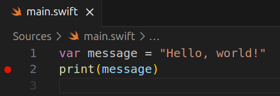

Next, select **Run ▸ Start Debugging** from the menu bar or press **F5** to start the debugger:

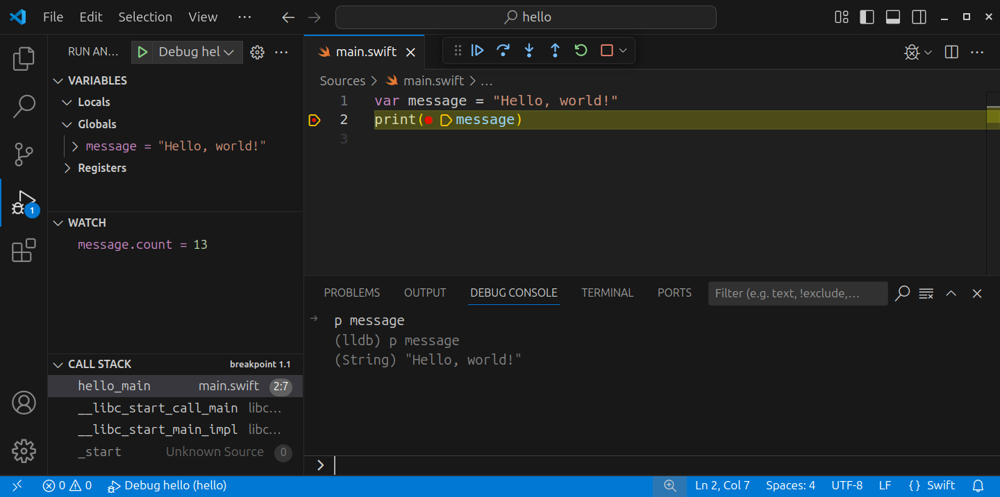

Use the debug console and floating toolbar to interact with the program.

When you’re done debugging, use the **Stop** button on the floating toolbar or press **Shift+F5** to stop the debugger.

## Testing

To run unit tests, select **View ▸ Testing** from the menu bar to open the **Test Explorer**. There, you can either run all tests, or run specific tests or suites:

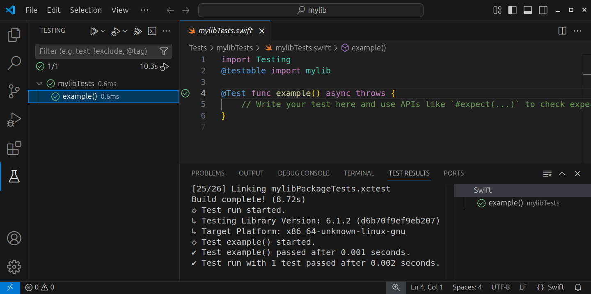

Test results will appear in the Test Explorer, the Test Results pane, and in the editor.

---

Last updated: 8 Jun. 2025 \
Author: [Steven Van Impe](https://github.com/svanimpe)
