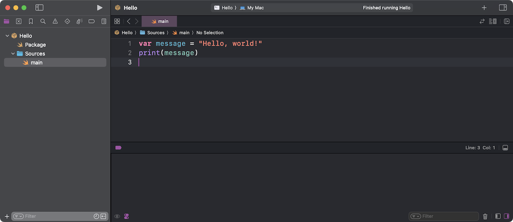
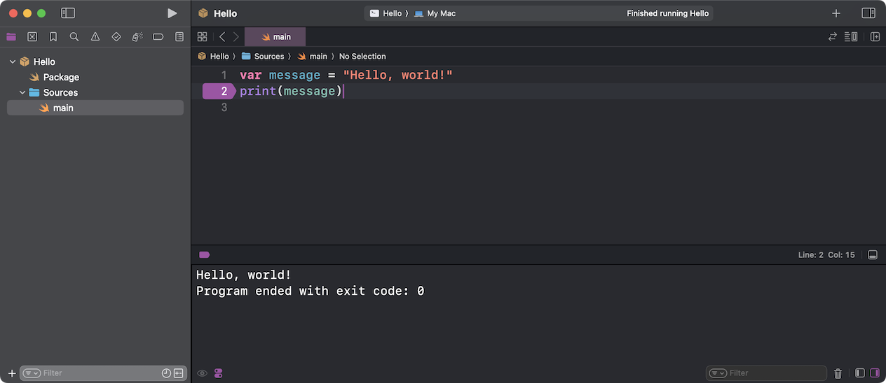
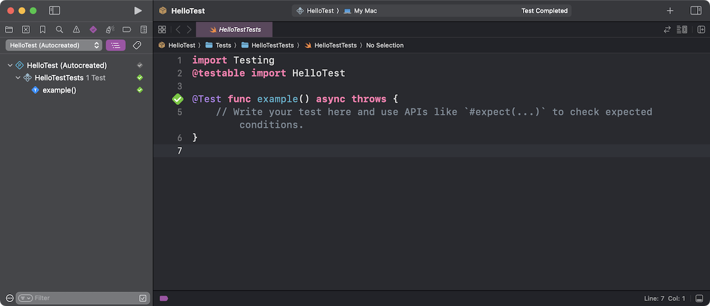

# Xcode


[**Xcode**](https://developer.apple.com/xcode/) is Apple’s integrated development environment (IDE). It includes everything you need to create Swift applications for Apple platforms.

## Features

Xcode is a fully-featured IDE that has all the features you need to get started with Swift on macOS:

✅ Syntax highlighting \
✅ Formatting \
✅ Completion \
✅ Quick help \
✅ Diagnostics \
✅ Fix-its \
✅ Refactoring \
✅ Run executables \
✅ Debugging \
✅ Testing

## Installation

You’ve already installed Xcode as part of the installation instructions for Swift on [macOS](../../platforms/macOS/README.md). If not, follow those instructions first.

## Usage

You can use Xcode to create and edit Swift files, as well as edit and run Swift packages. Xcode also supports **playgrounds** that evaluate your code line-by-line.

### Playgrounds

To create a playground, select **File ▸ New ▸ Playground...** from the menu bar, then choose the **Blank** template for macOS:


This will generate the following playground:


Replace the contents of this playground with your code, then use the circular button next to your code to evaluate the code up to that point. Xcode will show the results in the sidebar:


### Swift files

To create a Swift file, select **File ▸ New ▸ File...** from the menu bar, then choose the **Swift File** template for macOS:


This will generate the following file:


To edit an existing file, select **File ▸ Open...** from the menu bar, or — assuming Xcode is the default application for Swift files — double-click the file in Finder.

You can also use the **`xed`** command in Terminal to edit files with Xcode:

```
xed main.swift
```

### Swift packages

To edit a Swift package, open the **Package.swift** file in Xcode. This will load the entire package:



To build and run your program, press the **Run** button (the right-facing triangle) or select **Product ▸ Run** from the menu bar. Xcode will open its console window to show the program’s output:


If you don’t see the console, select **View ▸ Debug Area ▸ Activate Console** from the menu bar to show it.

To debug a program, first set a breakpoint by clicking next to the line of code where you want Xcode to pause execution:



Now run the program as before. Xcode will pause execution when it encounters a breakpoint:


When you’re done debugging, press the **Stop** button, which is next to the **Run** button.

To run your test targets, select **Product ▸ Test** from the menu bar, then select **View ▸ Navigators ▸ Tests** to see the results:



---

Last updated: 22 Sept. 2022 \
Author: [Steven Van Impe](https://github.com/svanimpe)
