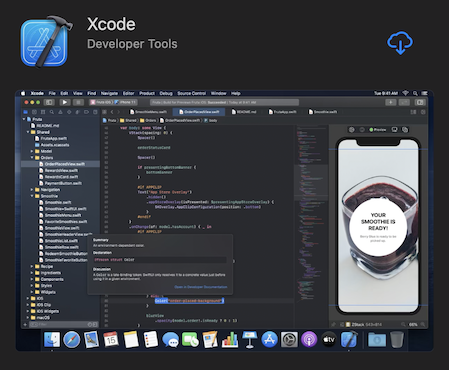
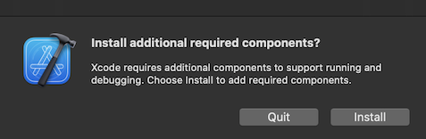

# macOS

On macOS, Swift comes bundled with [**Xcode**](../../editors/xcode/README.md), which is Apple’s integrated development environment (IDE). Xcode includes everything you need to create Swift applications for Apple platforms.

Download and install Xcode from the **App Store**:



Once installed, open Xcode, and it’ll ask your permission to install additional components:



Install these components, then open the **Terminal** application and enter the following command:

```
xcode-select -p
```

This command should print **/Applications/Xcode.app/Contents/Developer**, which is the directory where Xcode finds its command line tools. If you see a different directory, enter the following command to set the correct value:

```
sudo xcode-select -s /Applications/Xcode.app/Contents/Developer
```

> **Note**: This command requires administrator privileges, so it’ll ask for your password.

Finally, run the command below to see what version of Swift is on your system: 

```
swift --version
```

The current version of Xcode (12) includes Swift 5.3.

---

Last updated: 21 Oct. 2020 \
Author: [Steven Van Impe](https://github.com/svanimpe)
