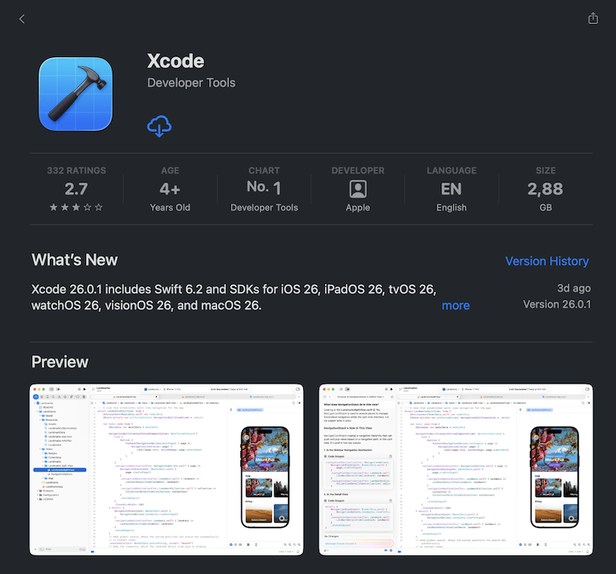

# macOS Sequoia

On macOS, Swift comes bundled with [**Xcode**](https://developer.apple.com/xcode/), which is Apple’s integrated development environment (IDE). Xcode includes everything you need to create Swift applications for Apple platforms.

Download and install Xcode from the **App Store**:



Once installed, open Xcode to complete its installation process.

Next, open the **Terminal** application and enter the following command:

```
xcode-select -p
```

This command should print **/Applications/Xcode.app/Contents/Developer**, which is the directory where Xcode finds its command line tools. If you see a different directory, enter the following command to set the correct value:

```
sudo xcode-select -s /Applications/Xcode.app/Contents/Developer
```

Finally, run the following command to verify which version of Swift you have installed:

```
swift --version
```

---

Last updated: 27 Sept. 2025 \
Author: [Steven Van Impe](https://github.com/svanimpe)
