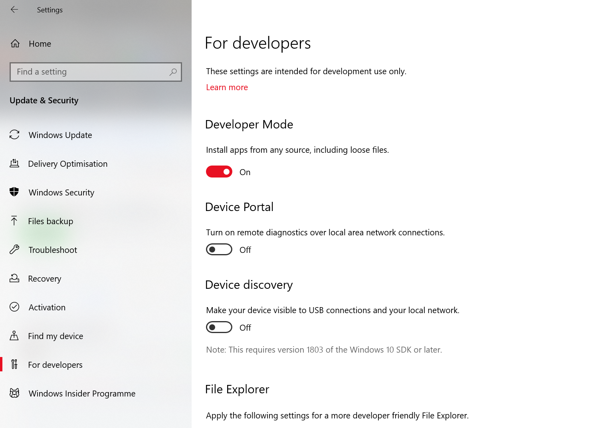
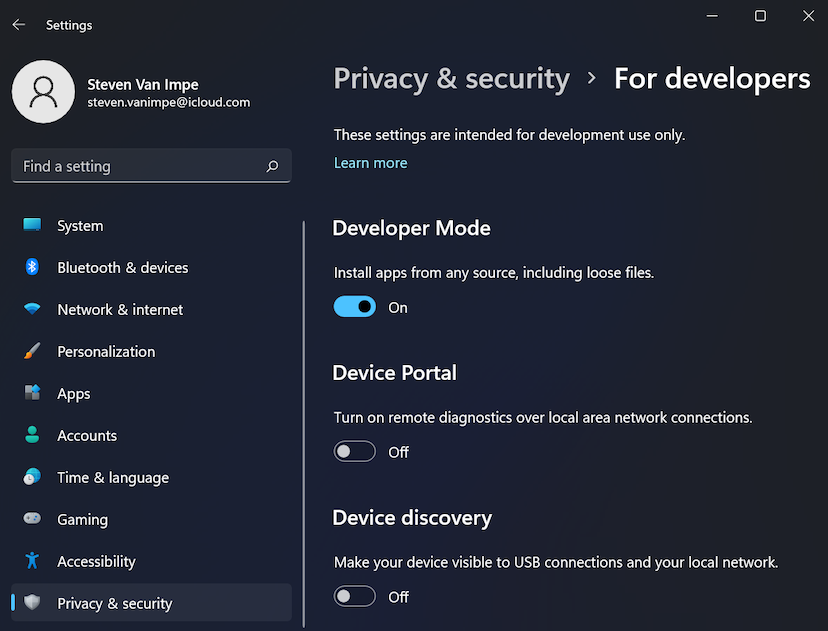
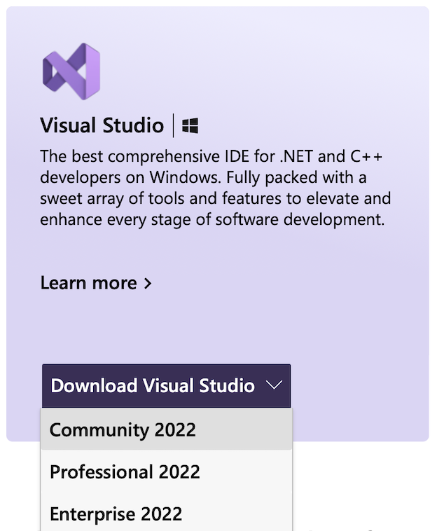
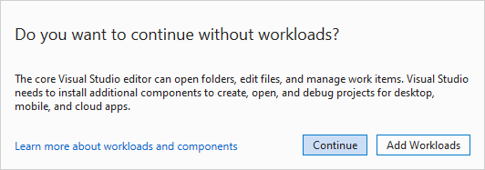
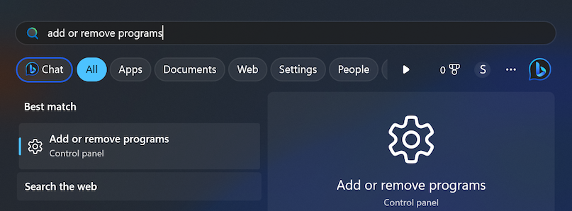
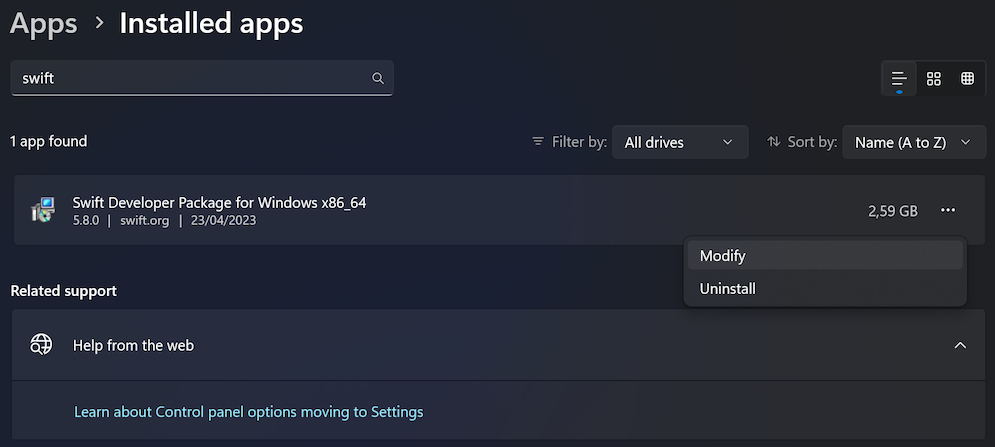
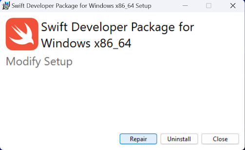

# Windows 10 / 11

The following instructions will help you get started with Swift on Windows.

## Prerequisites

Before you install Swift, first enable **developer mode**. This is required for the Swift Package Manager to work properly.

On Windows 10, open the **Start** menu and navigate to **Settings ▸ Update & Security ▸ For developers**. Here, you can enable developer mode:



On Windows 11, you can find this setting under **Settings ▸ Privacy & security ▸ For developers**:



Next, install or update **App Installer** from the Microsoft Store:


This will make sure you have the Windows Package Manager (**winget**) installed.

## Dependencies

Open **Command Prompt** and install Git and Python with the following commands:

```
winget install Git.Git
winget install Python.Python.3.10
python -m ensurepip
python -m pip install six
```

Next, download and install [**Visual Studio 2022**](https://visualstudio.microsoft.com), which is Microsoft’s IDE for development on Windows. Although you won’t use Visual Studio to develop Swift applications, you’ll need some of the libraries that come with it.

If you don’t already have Visual Studio, install the free community edition:



During installation, select the following **individual components**:

- Windows 10 SDK (10.0.19041.0)
- MSVC v143 - VS 2022 C++ x64/x86 build tools (Latest)

These are the only Visual Studio components you need for Swift development. If Visual Studio prompts you about installing workloads, it’s safe to continue without adding any:



Next, return to **Command Prompt** and check which version of Swift is available from **winget**:

```
winget show Swift.Toolchain
```

If this is the latest version (currently 5.8), install it as follows:

```
winget install Swift.Toolchain
```

Otherwise, download and install the latest release from [swift.org](https://swift.org/download/#releases).

You’ll see some security warnings during installation; this is normal:


Click **More info**, then **Run anyway** to run the installer.

After installing Swift, open **Command Prompt** and verify that you can run the following command:

```
swift --version
```

## Repairing after an upgrade

In the future, if you upgrade either Swift, Visual Studio, or Windows itself, you may encounter errors that prevent you from compiling your code. To fix these errors, repair your installation as follows:

First, open the **Add or remove programs** control panel:



There, search for **Swift**, click the triple dots, and select **Modify**:



This will open the Swift installer, where you can select **Repair** to fix your installation:



## Known issues

- The REPL is currently unavailable on Windows ([#13804](https://bugs.swift.org/browse/SR-13804)).
- Running source files with `swift` is currently unavailable on Windows ([#13805](https://bugs.swift.org/browse/SR-13805)).
- Unicode output may not display properly on the command line.

---

Last updated: 23 Apr. 2023 \
Authors: [Saleem Abdulrasool](https://github.com/compnerd), [Steven Van Impe](https://github.com/svanimpe)
