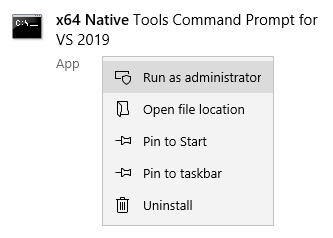

# Windows 10 [Experimental]

The following instructions will help you get started with Swift on Windows. However, Windows support is still under development so some issues are to be expected. When using Swift on Windows, we recommend that you regularly check these instructions for updates.

## Prerequisites

Before you install Swift, first enable **developer mode**. Open the **Start** menu and navigate to **Settings ▸ Update & Security ▸ For developers**. Here, you can enable developer mode:


Next, install [**Visual Studio 2019**](https://visualstudio.microsoft.com), which is Microsoft’s IDE for development on Windows. Although you won’t use Visual Studio to develop Swift applications, you’ll need some of the tools and libraries that come with it.

If you don’t already use Visual Studio, install the free community edition:


During installation, select the latest versions of the following **individual components**:

- Git for Windows
- MSVC v142 - VS 2019 C++ x64/x86 build tools
- Python 3 64-bit
- Windows Universal C Runtime
- Windows 10 SDK

These are the only Visual Studio components you need for Swift development.

## Installation

Next, download and install the latest [snapshot](https://swift.org/download/#snapshots) of Swift for Windows 10. You’ll see some security warnings during installation; this is normal.

After installing Swift, open the **Start** menu and find the **x64 Native Tools Command Prompt for VS 2019**. Right-click this application and select **Run as administrator**:



At this prompt, enter the following commands:

```
copy %SDKROOT%\usr\share\ucrt.modulemap "%UniversalCRTSdkDir%\Include\%UCRTVersion%\ucrt\module.modulemap"
copy %SDKROOT%\usr\share\visualc.modulemap "%VCToolsInstallDir%\include\module.modulemap"
copy %SDKROOT%\usr\share\visualc.apinotes "%VCToolsInstallDir%\include\visualc.apinotes"
copy %SDKROOT%\usr\share\winsdk.modulemap "%UniversalCRTSdkDir%\Include\%UCRTVersion%\um\module.modulemap"
```

These commands copy files from the Swift installation over to Visual Studio. You’ll need to repeat these commands whenever you update Swift or Visual Studio.

Finally, verify that you can run the following command:

```
swift --version
```

## Known issues

- The REPL is currently unavailable on Windows ([#13804](https://bugs.swift.org/browse/SR-13804)).
- Immediate mode (running `swift file.swift`) is currently unavailable on Windows ([#13805](https://bugs.swift.org/browse/SR-13805)).
- When using **`swiftc`**, you have to add either `-sdk $env:sdkroot` (in **PowerShell**) or `-sdk %sdkroot%` (in **Command Prompt**) to your command.
- Executables ran using `swift run` behave incorrectly ([#13806](https://bugs.swift.org/browse/SR-13806)). As a workaround, use `swift build` to build the package, then run the executable manually.
- Unicode output is poorly supported ([#13807](https://bugs.swift.org/browse/SR-13807)). For the best results, use the new [Windows Terminal](https://www.microsoft.com/en-us/p/windows-terminal/9n0dx20hk701) and execute `chcp 65001` prior to running a Swift application.

---

Last updated: 5 Nov. 2020 \
Author: [Saleem Abdulrasool](https://github.com/compnerd)
