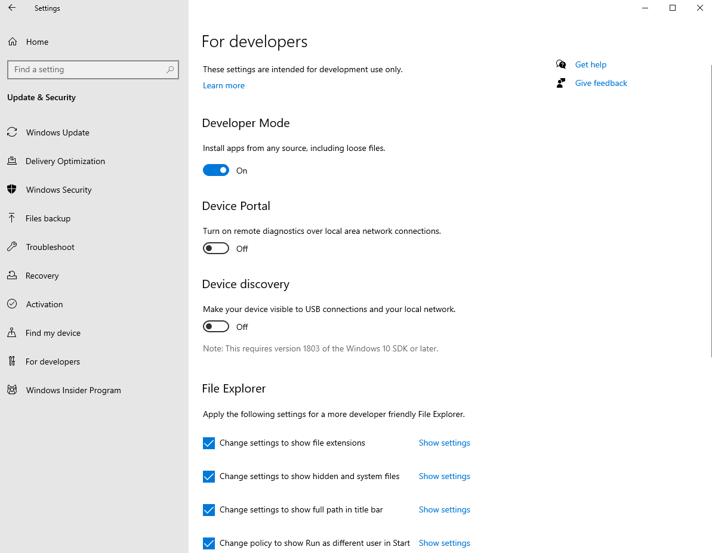

# Windows 10

The following instructions will help you get started with Swift on Windows 10.

## Prerequisites

Before you install Swift, first enable **Developer Mode**. This is required for the Swift Package Manager to work properly. You can find this setting under **Settings ▸ Update & Security ▸ For developers**:



Next, install or update **App Installer** from the [Microsoft Store](https://apps.microsoft.com/detail/9nblggh4nns1):


Alternatively, you can download an MSIX installer [here](https://learn.microsoft.com/en-us/windows/msix/app-installer/install-update-app-installer).

Updating App Installer will make sure you have the Windows Package Manager (**winget**) installed.

> **Note**: App Installer requires Windows 10 version 1709 (build 16299), so make sure your system is up-to-date.

## Installation

Swift requires some components from [**Visual Studio 2022**](https://visualstudio.microsoft.com), which is Microsoft’s IDE for development on Windows. Although you won’t use Visual Studio to develop Swift applications, you’ll need some of the libraries that come with it.

Open **Command Prompt** and run the following command to install the required components:

```
winget install --id Microsoft.VisualStudio.2022.Community --exact --force --custom "--add Microsoft.VisualStudio.Component.Windows11SDK.22000 --add Microsoft.VisualStudio.Component.VC.Tools.x86.x64"
```

With these components in place, you can now install Swift and its remaining dependencies (Git and Python):

```
winget install --id Swift.Toolchain --exact
```

Finally, restart your terminal and verify that you can run the following command:

```
swift --version
```

## Known issues

- The REPL is currently unavailable on Windows ([#13804](https://bugs.swift.org/browse/SR-13804)).
- Running source files with `swift` is currently unavailable on Windows ([#13805](https://bugs.swift.org/browse/SR-13805)).
- Unicode output may not display properly on the command line.

---

Last updated: 20 Oct. 2024 \
Authors: [Saleem Abdulrasool](https://github.com/compnerd), [Steven Van Impe](https://github.com/svanimpe)
