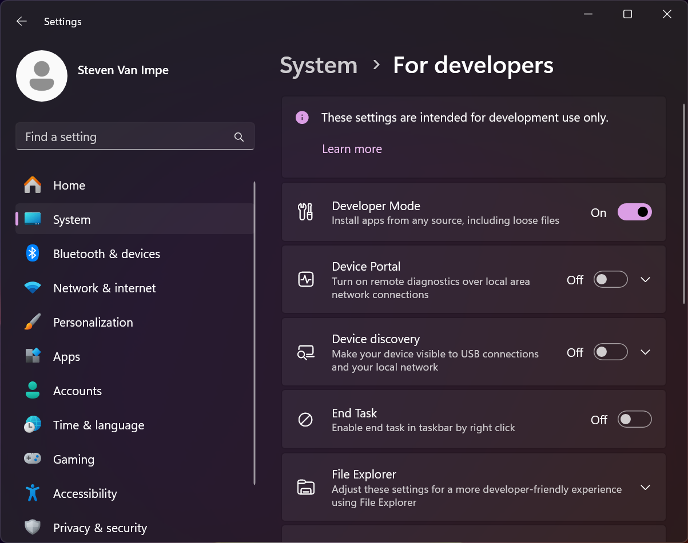

# Windows 11

The following instructions will help you get started with Swift on Windows 11.

## Prerequisites

Before you install Swift, first enable **Developer Mode**. This is required for the Swift Package Manager to work properly. You can find this setting under **Settings ▸ System ▸ For developers**:



## Installation

Swift requires some components from [**Visual Studio 2022**](https://visualstudio.microsoft.com), which is Microsoft’s IDE for development on Windows. Although you won’t use Visual Studio to develop Swift applications, you’ll need some of the libraries that come with it.

Open **Terminal** and run the following command to install the required components:

```
winget install --id Microsoft.VisualStudio.2022.Community --exact --force --custom "--add Microsoft.VisualStudio.Component.Windows11SDK.22000 --add Microsoft.VisualStudio.Component.VC.Tools.x86.x64"
```

With these components in place, you can now install Swift and its remaining dependencies (Git and Python):

```
winget install --id Swift.Toolchain --exact
```

Finally, restart your terminal and run the following command to verify which version of Swift you have installed:

```
swift --version
```

## Known issues

- Unicode output may not display properly on the command line.

---

Last updated: 27 Sept. 2025 \
Authors: [Saleem Abdulrasool](https://github.com/compnerd), [Steven Van Impe](https://github.com/svanimpe)