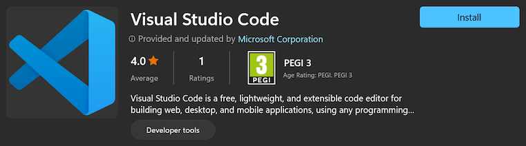
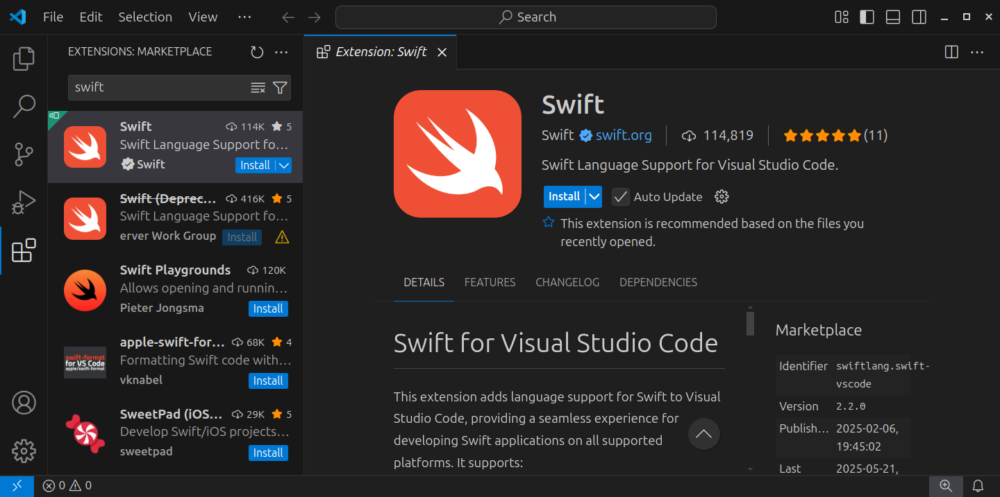

# Installing Visual Studio Code


[**Visual Studio Code**](https://code.visualstudio.com) is a free and open source editor developed by Microsoft. It’s a cross-platform editor that supports many languages, including Swift. This Swift support is provided by an [official extension](https://marketplace.visualstudio.com/items?itemName=swiftlang.swift-vscode) which turns Visual Studio Code into an excellent development enviroment for Swift.

This guide explains how you can install Visual Studio Code on various platforms. Follow the installation instructions for your platform first, then skip to the instructions for installing the Swift extension.

## Installation on Windows

Download and install Visual Studio Code from the Microsoft Store:



Alternatively, you can download an installer from [code.visualstudio.com](https://code.visualstudio.com).

After installation, you can launch Visual Studio Code from the **Start** menu. You can also launch it from the command line, using the **`code`** command:

```
code
```

## Installation on macOS

On macOS, use [**Homebrew**](https://brew.sh) to install Visual Studio Code.

Open **Terminal** and run the following command to install Homebrew if you don’t have it already:

```sh
/bin/bash -c "$(curl -fsSL https://raw.githubusercontent.com/Homebrew/install/HEAD/install.sh)"
```

Now install Visual Studio Code as follows:

```sh
brew install visual-studio-code
```

Alternatively, you can download a zip archive from [code.visualstudio.com](https://code.visualstudio.com). Unzip this archive and drag the application to your **Applications** directory.

After installation, you can launch Visual Studio Code from the **Applications** directory or by using Spotlight. You can also launch it from the command line, using the **`code`** command:

```
code
```

## Installation on Ubuntu

Open **Terminal** and run the following command to install Visual Studio Code: 

```
sudo snap install --classic code
```

After installation, you can launch Visual Studio Code by pressing the **Super** (or **Command** or **Windows**) key and searching for it — this may require logging out first. You can also launch it from the command line, using the **`code`** command:

```
code
```

## Installing the Swift extension

To install the Swift extension, select **View ▸ Extensions** from the menu bar, search “swift”, and install the extension published by [swift.org](https://www.swift.org):



This extension provides all of the features you need to work with Swift packages in Visual Studio Code. The [following guide](../packages/README.md) explains how to do that.

---

Last updated: 27 Sept. 2025 \
Author: [Steven Van Impe](https://github.com/svanimpe)
