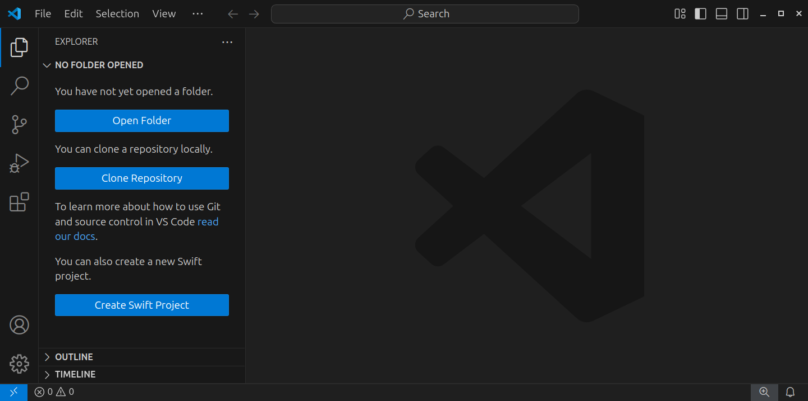
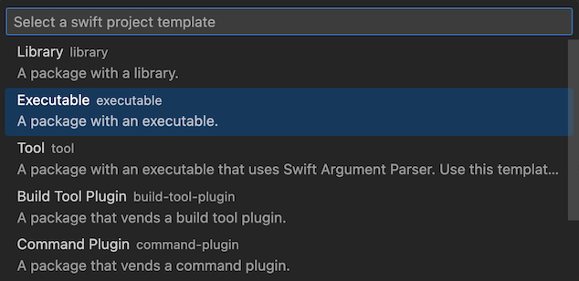
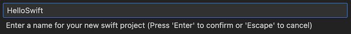
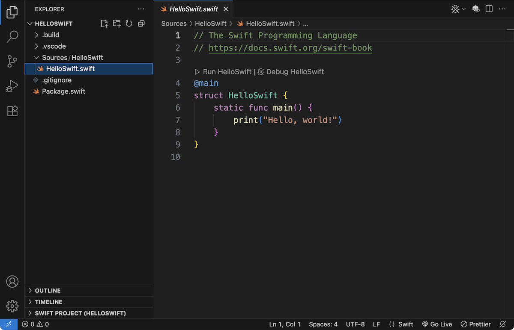
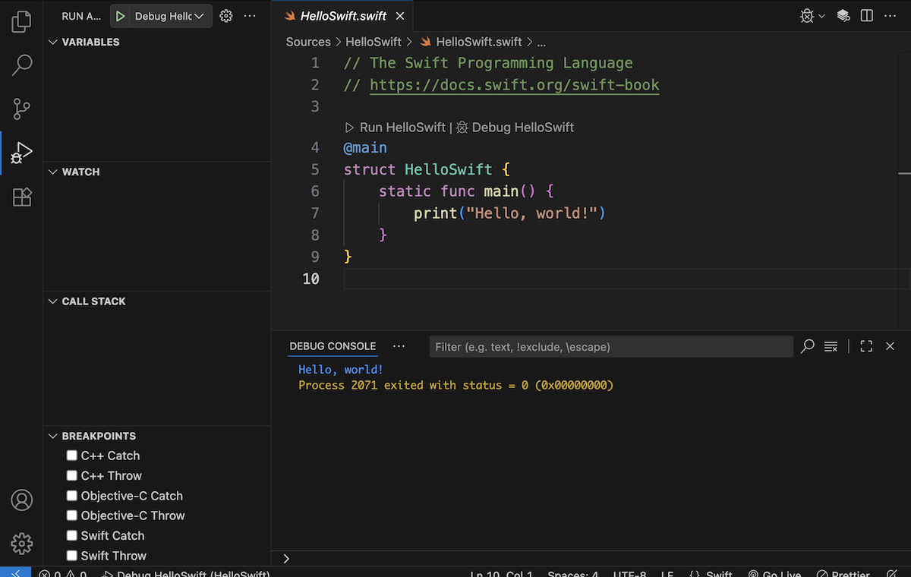
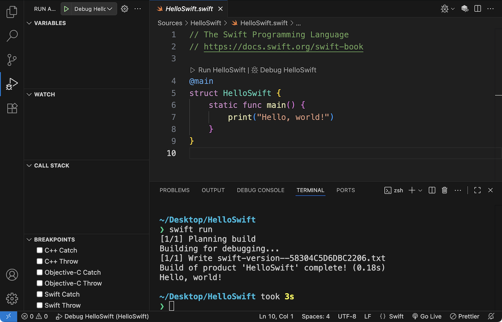

# Creating and running Swift Packages

This guide explains how you can create and run Swift packages in Visual Studio Code. Before you continue, make sure you have both Visual Studio Code and its Swift extension installed, as explained in the [previous guide](../installation/README.md).

## Creating packages

To create a new package for an executable program, open the **Explorer** (**View ▸ Explorer**) and select **Create Swift Project**:



Then select **Executable**:



Next, select a folder where you want to save the package, and give it a name:



Finally, select **Open** to open the package in the current window:



To open an existing package, select **File ▸ Open Folder...** from the menu bar and open the directory that contains the **Package.swift** file.

On the command line, you specify this directory as an argument for the `code` command:

```
code HelloSwift
```

## Running packages

To run your code, select **Run ▸ Run Without Debugging** from the menu bar or press **Ctrl+F5**:



You’ll see the output of your program appear in the debug console. If the console is hidden, select **View ▸ Debug Console** from the menu bar to show it.

Alternatively, select **View ▸ Terminal** to open the integrated terminal, then execute the `swift run` command:



The debug console doesn’t support interactive programs. If your program uses `readLine` to read input from the command line, you’ll need to use the integrated terminal to start it.

---

Last updated: 27 Sept. 2025 \
Author: [Steven Van Impe](https://github.com/svanimpe)
